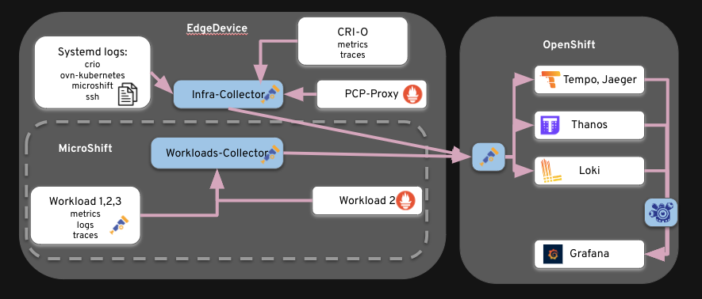
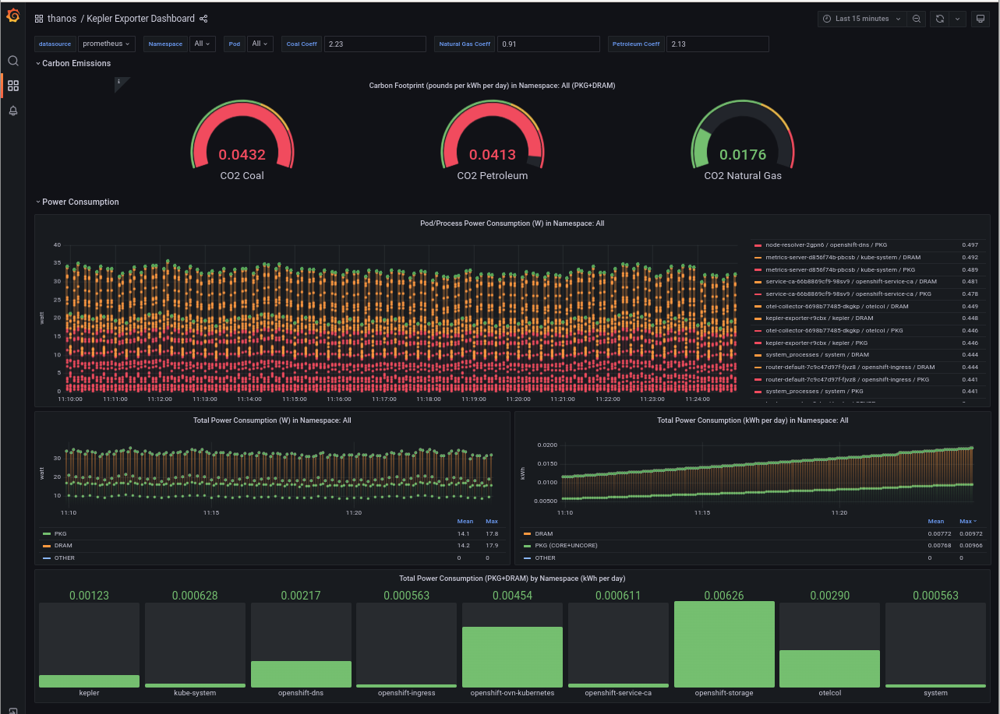
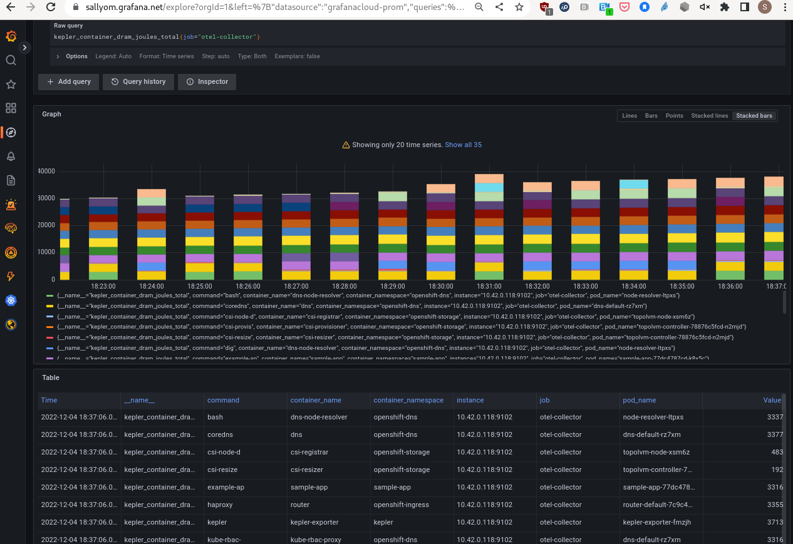
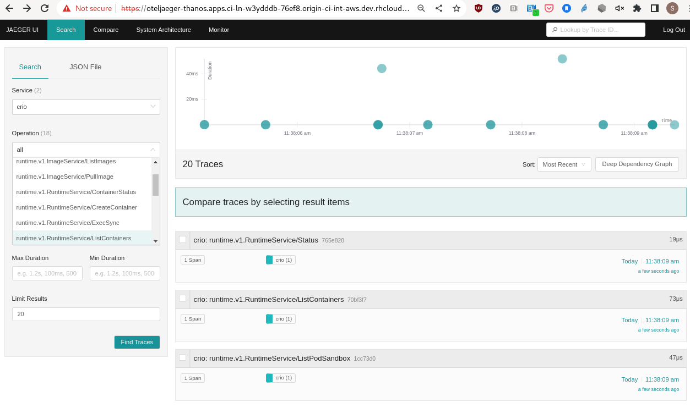

## Observability at the edge

This repository is a collection of manifests to enable observability in RH Device Edge and MicroShift.
An overview of a typical edge observability created with this repository

Included are the following observability scenarios:

1. [Observability stack on OpenShift](observability-hub/README.md)
3. [MicroShift Kepler deployment to OpenShift observability stack](edge/sample-app/kepler/README.md)
3. [Kepler RPM (non-K8s) metrics to OpenShift observability stack](edge/sample-app/kepler/kepler-rpm-host.md)
2. [Performance CoPilot (PCP) in RHEL Device Edge](./edge/edge-pcp-to-ocp/README.md)
2. [OpenTelemetry Collector for Systemd logs, CRIO traces at the edge](edge/otel-collector-infra/README.md)
3. [Sample Application with Traces](edge/sample-app/quarkus-superheroes/README.md)
1. [Kubernetes Metrics Server on MicroShift](edge/metrics-server/README.md)

### Screenshots

Data sent from MicroShift to OpenShift Grafana

Prometheus metrics from MicroShift 

Jaeger UI from OpenShift showing traces from edge machine

