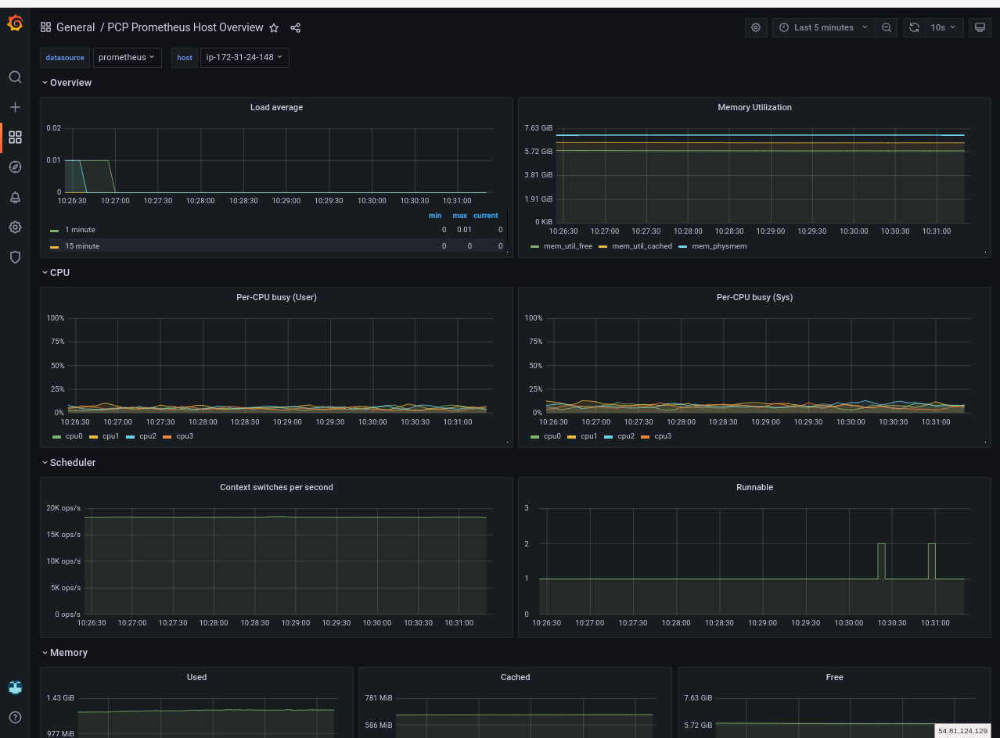

## Setting up Performance Co-Pilot in RHEL Device Edge

Performance Co-Pilot (PCP) data from any RHEL system can be directed to OpenShift (OCP) eliminating the need for prometheus at the edge.
Metrics are scraped with a Prometheus receiver configured in an  OpenTelemetry Collector (OTC) running in a podman container on the edge system.
Metrics are pushed with an OTLP exporter to an OTC running in the OCP cluster. From there, a Prometheus DataSource in Grafana can be used to visualize PCP metrics.

### Performance Co-Pilot in RHEL Device Edge

The [Red Hat Customer Portal](https://access.redhat.com/documentation/en-us/red_hat_enterprise_linux/9/html/monitoring_and_managing_system_status_and_performance/setting-up-pcp_monitoring-and-managing-system-status-and-performance)
documentation was used to deploy PCP. PCP data is visualized with Grafana running in OpenShift. An OpenTelemetry Collector pod running as a podman container enables the collection on the edge device. 

Starting PCP in any RHEL system is as easy as `dnf install pcp-zeroconf`. From there, consult the documentation to configure as needed. 

On the edge device, an OpenTelemetryCollector pod can scrape PCP metrics and push the data to OpenTelemetryCollector running in OpenShift.

## Send PCP metrics from RHEL machine to OpenShift

### Prepare mTLS certificates and keys in both the edge and OpenShift

To secure traffic from external OpenTelemetry Collector (OTC) to OpenShift OTC,
follow the [mTLS documentation](../../observability-hub/mtls/mTLS-otel-collectors.md). This will create a CA and
signed certificates for both the server (OpenShift OTC) and client (edge/external OTC).
This document also specifies the configmaps to create in the observability namespace that are 
mounted in OpenShift OTC deployment below. 

### RHEL machine

#### Update OpenTelemetry Collector config with OCP URLs, tokens

```bash
curl -o otelcol-config.yaml https://raw.githubusercontent.com/redhat-et/edge-ocp-observability/main/edge/edge-pcp-to-ocp/otelcol-config.yaml
```

Substitute for `$APPS_DOMAIN` in [otelcol-config.yaml](./otelcol-config.yaml) to configure the OpenShift OTC endpoint.

#### Run OpenTelemetry Collector with podman

```bash
mkdir otc # for file-storage extension, if configured

# Note the `certs` directory must exist at $(pwd)/.

sudo podman run --rm -d --name otelcol-host \
  --network=host \
  --user=0 \
  --cap-add SYS_ADMIN \
  --tmpfs /tmp --tmpfs /run  \
  -v /var/log/:/var/log  \
  -v /sys/fs/cgroup:/sys/fs/cgroup:ro \
  -v $(pwd)/certs/server.crt:/conf/server.crt.pem:Z \
  -v $(pwd)/certs/server.key:/conf/server.key:Z \
  -v $(pwd)/certs/ca.crt:/conf/ca.crt:Z \
  -v $(pwd)/otelcol-config.yaml:/etc/otelcol-contrib/config.yaml:Z \
  -v $(pwd)/otc:/otc:Z  \
  ghcr.io/open-telemetry/opentelemetry-collector-releases/opentelemetry-collector-contrib:latest --config=file:/etc/otelcol-contrib/config.yaml
```

#### Deploy Grafana and the Prometheus DataSource with PCP Prometheus Host Overview Dashboard

To view the prometheus metrics in Grafana, deploy a GrafanaDashboard for Performance Co-Pilot.

Run these commands against the **OpenShift hub cluster**

If there is already a Grafana instance with a Prometheus Datasource in OpenShift `-n observability`, run this command to
create a GrafanaDashboard for PCP:

```bash
oc apply -f $(pwd)/grafana-dashboard/pcp-dashboard.yaml
```

To deploy Grafana with a Prometheus DataSource in OpenShift, follow [OpenShift observability hub: Grafana](../../observability-hub/grafana/README.md)

You should now be able to access Grafana with `username: rhel` and `password:rhel` from the grafana route.

* Navigate to Dashboards -> to find the PCP Prometheus Host Overview dashboard.
* Navigate to Explore -> to find the Prometheus data source to query metrics from.

Here is a screenshot of PCP Prometheus Host Overview Grafana dashboard


