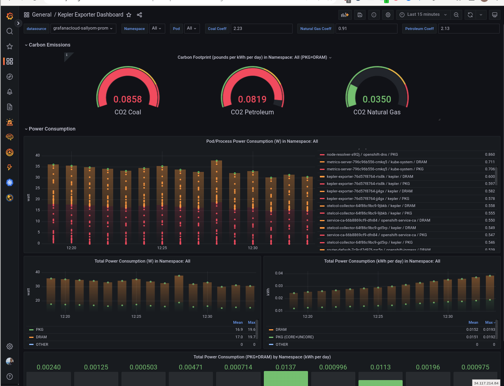

## Kepler on MicroShift in a RHEL based distribution

This assumes MicroShift is installed on a RHEL based machine.
SSH into the virtual machine.

### Execute below commands from within the RHEL machine

Configure cgroups-v2 and install `kernel-devel-$(uname -r)`.
The following script will not work if running in rpm-ostree based OS such as RHEL Device Edge.
With rpm-ostree based systems, be sure your machine is running with cgroupsv2 enabled,
and also that the package `kernel-devel-$(uname -r)` is installed.

```bash
curl -o configure-kepler-vm.sh https://raw.githubusercontent.com/sallyom/microshift-observability/main/manifests/sample-instrumented-applications/kepler/configure-microshift-vm-kepler.sh
./configure-kepler-vm.sh
# script will ask for your RH account creds for subscription if not already registered
# reboot VM and ssh back in
```

#### Start MicroShift service (if not already running)

```bash
sudo systemctl enable --now microshift
mkdir ~/.kube
sudo cp /var/lib/microshift/resources/kubeadmin/kubeconfig ~/.kube/config
sudo chown -R redhat:redhat ~/.kube
oc get pods -A # all pods should soon be running
```

#### Kepler Deployment

Kepler is a research project that that uses eBPF to probe CPU performance counters and Linux kernel tracepoints
to calculate an application's carbon footprint. Refer to [Kepler documentation](https://sustainable-computing.io/) for further information.

> **Note**
> For running in MicroShift on Red Hat Device Edge, I've found it's easiest to use `kustomize` to apply kepler manifests,
> and a standalone OpenTelemetry Collector either with podman or as a sidecar container in the kepler-exporter DaemonSet.
> On other systems where resource constraints are less of a concern, `helm` and `opentelemetry operator` offer convenience.

```bash
git clone https://github.com/sustainable-computing-io/kepler.git
cd kepler
```

#### Modify Kepler manifests for OpenShift

Uncomment the OpenShift lines in `manifests/config/exporter/kustomization.yaml`
(`Line#3` and `Line#16` at time of this writing),
and remove the `[]` in the line `- patchesStrategicMerge: []`. Then, apply
the kepler manifests.

```bash
oc create ns kepler
oc apply --kustomize $(pwd)/manifests/config/base -n kepler

# Check that kepler pod is up and running before proceeding
```

### Configure OpenShift cluster

#### Deploy Thanos Receive in OpenShift

For this example, we will use Thanos. A `Thanos Operator` as well as the `Observability Operator` are available in OperatorHub with
any OpenShift installation. However, for this example,
refer to [OpenShift with Thanos-Receive](../../openshift-thanos-receive.md) to enable a simple Prometheus remote-write
endpoint with `thanos-receive`.

You can substitute `thanos-receive` for any endpoint where it's possible to send OTLP and/or Prometheus data.
What's required is a `prometheusremotewrite` endpoint or an `OTLP` receiver endpoint.
 
#### Ensure OpenShift CA and token are on the edge system

```bash
# scp'd files from OpenShift are expected to be in $HOME on the edge system.

ssh redhat@<RHEL_VM>
ls ~/ca.crt ~/edge-token ~/thanos-receive-url
```

### Launch OpenTelemetry Collector to receive and export kepler metrics

There are two options shown here for launching the OpenTelemetry Collector.
The first is to launch OpenTelemetry Collector as a sidecar container to the kepler exporter DaemonSet.
The second is to run OpenTelemetry Collector with podman on the host, external
to MicroShift.
Both of these options remote-write kepler metrics to a thanos-receive pod running in OpenShift.

#### Option 1: Add collector sidecar and patch the kepler-exporter service

Download the opentelemetry config file and modify as necessary to configure receivers and exporters.

```bash
curl -o microshift-otelconfig.yaml https://raw.githubusercontent.com/sallyom/microshift-observability/main/manifests/sample-instrumented-applications/kepler/microshift-otelconfig.yaml
```

Run the following to launch an OpenTelemetry Collector sidecar container in the kepler-exporter Daemonset

```bash
oc create configmap -n kepler client-ca --from-file ~/ca.crt
oc create configmap -n kepler edge-token --from-file ~/edge-token
oc create -n kepler -f microshift-otelconfig.yaml

# patch service to expose otlp ports
oc patch service kepler-exporter -n kepler --patch-file https://raw.githubusercontent.com/sallyom/microshift-observability/main/manifests/sample-instrumented-applications/kepler/patch-service.yaml

# patch daemonset to add a sidecar opentelemetry collector container
oc patch daemonset kepler-exporter -n kepler --patch-file https://raw.githubusercontent.com/sallyom/microshift-observability/main/manifests/sample-instrumented-applications/kepler/patch-sidecar-otel.yaml
```

Check that the kepler-exporter now includes an otc-container and that the collector is receiving and exporting metrics as expected.
Finally, [deploy grafana in OpenShift with a prometheus datasource to view the metrics.](#deploy-grafana-and-the-prometheus-datasource-with-kepler-dashboard)

####  Option 2: Run OpenTelemetry Collector in a local pod

Download the opentelemetry config file and modify as necessary to configure receivers and exporters.
This example also collectos Performance Co-Pilot metrics. Remove that target from the receivers section if not running PCP.

```bash
curl -o podman-otelconfig.yaml https://raw.githubusercontent.com/sallyom/microshift-observability/main/manifests/sample-instrumented-applications/kepler/podman-otelconfig.yaml
```

```bash
cd $HOME
# Note the ca.crt & edge-token are assumed to exist at $(pwd)/.

# patch kepler to run with hostnetwork, for compatibility with podman running opentelemetry collector
oc patch -n kepler daemonset kepler-exporter --patch-file https://raw.githubusercontent.com/sallyom/microshift-observability/main/manifests/sample-instrumented-applications/kepler/patch.yaml

sudo podman run --rm -d --name otelcol-host \
  --security-opt label=disable  \
  --user=0 \
  --cap-add SYS_ADMIN \
  --tmpfs /tmp --tmpfs /run \
  -v /var/log/:/var/log 
  -v /sys/fs/cgroup:/sys/fs/cgroup:ro \
  -v $(pwd)/ca.crt:/conf/ca.crt:z \
  -v $(pwd)/edge-token:/conf/edge-token:z \
  -v $(pwd)/podman-otelconfig.yaml:/etc/otelcol-contrib/config.yaml:z\
  --net=host \
  quay.io/sallyom/ubi8-otelcolcontrib:latest --config=file:/etc/otelcol-contrib/config.yaml
```
Check with `sudo podman logs otelcol-host` that the collector is receiving and exporting metrics as expected.
Finally, [deploy grafana in OpenShift with a prometheus datasource to view the metrics.](#deploy-grafana-and-the-prometheus-datasource-with-kepler-dashboard)

### Deploy Grafana and the Prometheus DataSource with Kepler Dashboard

You can query metrics from your application in OpenShift, `-n thanos` with the `thanos-querier route`.
However, you might prefer to view the prometheus metrics in Grafana with the upstream
[kepler exporter dashboard](https://github.com/sustainable-computing-io/kepler/blob/main/grafana-dashboards/Kepler-Exporter.json)

To deploy grafana, prometheus, and the dashboard, run this against the **OpenShift cluster**

```bash
cd microshift-observability/manifests/sample-instrumented-applications/kepler/dashboard-example-kepler
./deploy-grafana.sh
```

You should now be able to access Grafana with `username: rhel` and `password:rhel` from the grafana route.

* Navigate to Dashboards -> to find Kepler Exporter dashboard.
* Navigate to Explore -> to find the Prometheus data source to query metrics from.

Hopefully, you'll see something like this!


