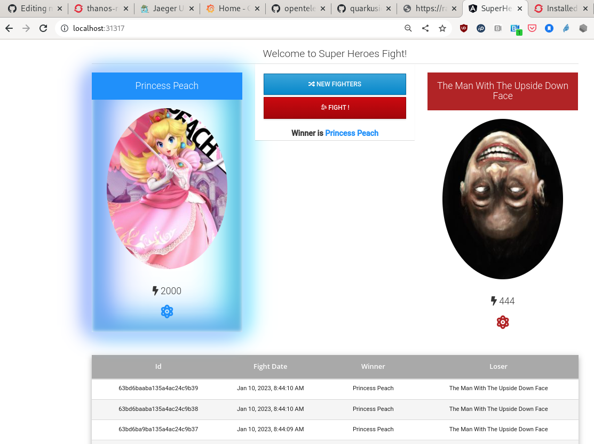

#### Sample Application to generate OTLP trace data

Refer to [quarkusio/quarkus-super-heroes](https://github.com/quarkusio/quarkus-super-heroes.git) for more information
about this sample application.

This example assumes OpenShift is running and is configured to act as an observability hub.
Refer to [Send Telemetry to OpenShift Cluster](../../openshift-observability-hub/README.md). 

```bash
cd /checkout/of/microshift-observability
oc create ns sample-app

# Deploy the minikube version of application, since it configures NodePort services that we'll want
oc -n sample-app apply -f manifests/sample-instrumented-applications/sample-tracing-app/quarkus-super-heroes.yaml

# Update ui-super-heroes deployment with APP_BASE_URL env variable
oc edit deployment ui-super-heroes -n sample-app

# add the following
    spec:
      containers:
      - env:
        - name: API_BASE_URL
          value: http://<VM_IP>:30489
```

Create OpenShift ca.crt and serviceaccount token configmaps. This assumes
the files `ca.crt`, `edge-token`, `thanos-receive-url`, and `ocp-otelcol-url`
have been scp'd to Microshift VM. For more on that, refer to
[openshift-observability-hub](../../openshift-observability-hub/README.md).

```bash
# may need 'oc delete cm/client-ca -n sample-app`, `oc delete cm/edge-token -n sample-app` first
oc create configmap -n sample-app client-ca --from-file ca.crt
oc create configmap -n sample-app edge-token --from-file edge-token
```

Edit sample-app-otelcol-config.yaml with urls

- copy contents of `~/thanos-receive-url` to `sample-app-otelcol-config.yaml` Line #45
- copy contents of `~/ocp-otelcol-url` to `sample-app-otelcol-config.yaml` Line #35

Finally, exit the MicroShift VM to forward the ui-super-heroes and rest-fights ports to local machine,
to access the application and generate traffic with telemetry data.

**run from local terminal tabs, not VM**

```bash
ssh -L 30357:192.168.122.15:30357 redhat@192.168.122.15 -N
ssh -L 30489:192.168.122.15:30489 redhat@192.168.122.15 -N
```

**SSH back into MicroShift VM**

```bash
oc apply -n sample-app -f ca-cm.yaml
oc apply -n sample-app -f sample-app-otelcol-config.yaml
oc apply -n sample-app -f microshift-otelcol-deployment.yaml
oc get pods -n sample-app # look for running otelcollector pod
```

Open `localhost:30357` from local browser to fight! You should see something like this:




You should now see traces from the sample-app in the OpenShift cluster `-n thanos` and the `Jaeger` route.
You should be able to view metrics from the quarkus app in `-n thanos` and `thanos-querier` route.
