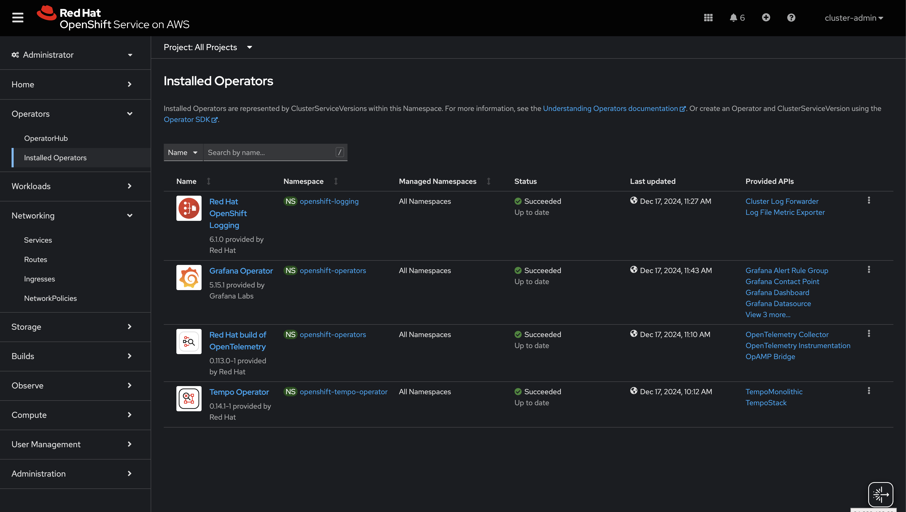

## Send Telemetry from edge to OpenShift

**WORK IN PROGRESS**

Telemetry data from the edge (RH Device Edge, MicroShift, Single Node OpenShift) can be directed to OpenShift (OCP)
eliminating the need for an expensive observability stack at the edge.

The OpenTelemetry Collector (OTC) is well-suited for funneling telemetry from the edge to an observability hub.
OTC is also useful to simplify collection at the observability hub by providing a single exposed endpoint to
receive all edge data, while at the edge a single connection can export all data.

### Hub OpenShift cluster

This image shows the list of operators installed. These are available from OperatorHub.
(Red Hat Single Sign-On Operator is not necessary)



#### Operator descriptions

1. **Red Hat OpenShift distributed tracing data collection**: The OpenTelemetry Collector (OTC) is provided from this operator. OTC will expose
an OTLP receiver endpoint for edge devices. Metrics, logs and traces will be distributed from the OTC to various backends, all running
within the observability namespace (Loki, Tempo, Grafana, Prometheus).

2. **Observability Operator**: Provides Prometheus APIs and monitoring stack using Prometheus, Alertmanager and Thanos Querier.
Thanos Receive can also be deployed as a sidecar to Prometheus, to enable a remote-write endpoint for the OTC.

3. **Loki Operator**: Provides `LokiStack` API. Loki is the backend for logging.

4. **Tempo Operator**: Provides `TempoStack` API. This is the backend for distributed tracing. An S3-compatible storage (Minio) will be paired with Tempo.

5. **Grafana Operator**: Provides Grafana APIs including `GrafanaDashboard`, `Grafana`, and `GrafanaDataSource` that will be used to visualize telemetry.

#### Create custom resources and configurations for observability hub

Metrics Backend (Prometheus with Thanos sidecar)

```bash
oc apply -f monitoring-stack.yaml -n observability
```

Logging Backend (Loki with Minio container for s3 storage)

```bash
# edit storageclassName & secret as necessary
# secret and storage for testing only
oc apply -f minio-secret.yaml -n observability
oc apply -f minio-loki-pvc.yaml -n observability
oc apply -f minio-loki-svc.yaml -n observability
oc apply -f minio-loki.yaml -n observability
oc apply -f lokistack.yaml -n observability
```

Tracing Backend (Tempo with Minio for S3 storage)

```bash
# edit storageclassName & secret as necessary
# secret and storage for testing only
oc apply -f minio-secret-tempo.yaml -n observability
oc apply -f minio-tempo-pvc.yaml -n observability
oc apply -f minio-tempo-svc.yaml -n observability
oc apply -f minio-tempo.yaml -n observability
oc apply -f tempostack.yaml -n observability
```

OpenTelemetryCollector

```bash
oc apply -f otelcol-cabundle.yaml
oc apply -f otel-collector.yaml
```
**WORK IN PROGRESS**
